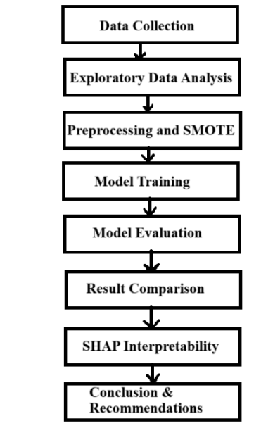
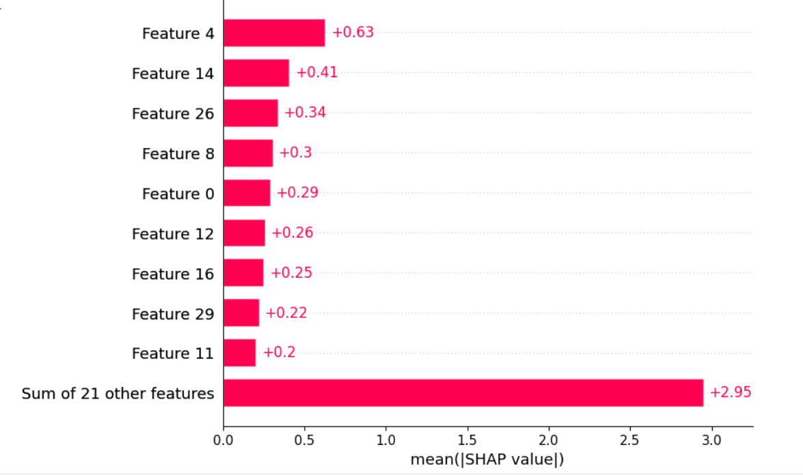
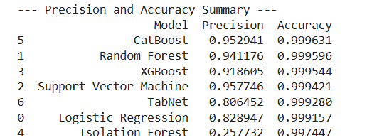

# 💳 Credit Card Fraud Detection

This project focuses on detecting fraudulent credit card transactions using both traditional Machine Learning (ML) and Deep Learning (DL) models. Given the highly imbalanced nature of fraud datasets, the system incorporates resampling techniques and interpretability tools (like SHAP) to ensure accurate and trustworthy predictions.

A comparative study between multiple models — including XGBoost and PyTorch TabNet — was conducted to identify the best performer in terms of precision, recall, F1-score, and AUC.

---

## 🎯 Objective

- To build a robust classification pipeline to detect fraud in credit card transactions.
- To compare the performance of traditional ML and modern DL architectures.
- To provide explainability using SHAP for real-world deployment readiness.

---

## ⚙️ Tech Stack

- **Language:** Python  
- **ML Libraries:** Scikit-learn, XGBoost  
- **DL Framework:** PyTorch TabNet  
- **Explainability:** SHAP  
- **Tools:** Jupyter Notebook, Google Colab, Pandas, Matplotlib, Seaborn

---

## 🔍 Features

- ✅ Support for **imbalanced datasets** using under/over-sampling techniques.
- 📊 Trains and evaluates **multiple models** (Random Forest, XGBoost, TabNet).
- 🧠 Compares ML and DL using **metrics**: Accuracy, AUC, Precision, Recall, F1-score.
- 🔍 **Explainable AI** via SHAP for understanding key feature contributions.
- 📈 Visual insights: Confusion matrix, feature importance, SHAP plots.

---

## 🔄 Project Workflow

---

## 📸 Output Visuals

### 🔍 Feature Importance (SHAP)

### 📊 Model Evaluation

---

## 📝 Conclusion

This project proves that **modern DL models** can outperform classical ML methods in fraud detection, particularly when **SHAP** is used for model interpretability. The study also highlights the importance of addressing **class imbalance** in real-world financial applications.
